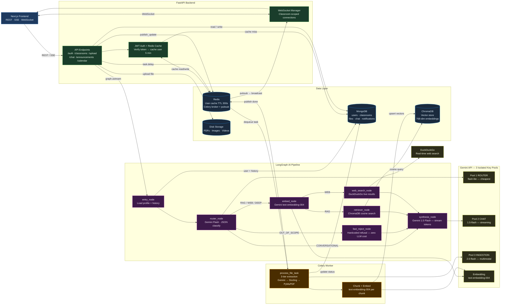

# UniFlow — High-Level System Architecture

```mermaid
flowchart LR

    FE["Next.js Frontend\nREST · SSE · WebSocket"]

    subgraph BACKEND["FastAPI Backend"]
        EP["API Endpoints\n/auth  /classrooms  /upload\n/chat  /announcements  /calendar"]
        AUTH["JWT Auth + Redis Cache\nVerify token → cache user 5 min"]
        WS["WebSocket Manager\nClassroom-scoped connections"]
    end

    subgraph LANGGRAPH["LangGraph AI Pipeline"]
        LG1["entry_node\nLoad profile + history"]
        LG2["router_node\nGemini Flash · JSON classify"]
        LG3["fast_reject_node\nHardcoded refusal — zero LLM cost"]
        LG4["embed_node\nGemini text-embedding-004"]
        LG5A["retriever_node\nChromaDB cosine search"]
        LG5B["web_search_node\nDuckDuckGo live results"]
        LG6["synthesis_node\nGemini 1.5 Flash — stream tokens"]

        LG1 --> LG2
        LG2 -->|"OUT_OF_SCOPE"| LG3
        LG2 -->|"CONVERSATIONAL"| LG6
        LG2 -->|"RAG / WEB / DEEP"| LG4
        LG4 -->|"RAG"| LG5A
        LG4 -->|"WEB"| LG5B
        LG3 --> LG6
        LG5A --> LG6
        LG5B --> LG6
    end

    subgraph WORKER["Celery Worker"]
        CW["process_file_task\n3-tier extraction\nGemini → Docling → PyMuPDF"]
        CEMB["Chunk + Embed\ntext-embedding-004 per chunk"]
        CW --> CEMB
    end

    subgraph DATASTORES["Data Layer"]
        MONGO[("MongoDB\nusers · classrooms\nfiles · chat · notifications")]
        REDIS[("Redis\nUser cache TTL 300s\nCelery broker + pubsub")]
        CHROMA[("ChromaDB\nVector store\n768-dim embeddings")]
        DISK[("Disk Storage\nPDFs · Images · Videos")]
    end

    subgraph GEMINI["Gemini API — 3 Isolated Key Pools"]
        G1["Pool 1 ROUTER\nflash-lite — cheapest"]
        G2["Pool 2 CHAT\n1.5-flash — streaming"]
        G3["Pool 3 INGESTION\n2.0-flash — multimodal"]
        G4["Embedding\ntext-embedding-004"]
    end

    DDGS["DuckDuckGo\nReal-time web search"]

    %% Client to API
    FE -->|"REST / SSE"| EP
    FE <-->|"WebSocket"| WS

    %% API internal
    EP --> AUTH
    AUTH <-->|"cache read/write"| REDIS
    AUTH -->|"cache miss"| MONGO

    %% API to data
    EP -->|"read / write"| MONGO
    EP -->|"upload file"| DISK
    EP -->|"task.delay"| REDIS

    %% API to AI pipeline
    EP -->|"graph.astream"| LG1

    %% WebSocket broadcasts
    EP -->|"publish_update"| REDIS
    REDIS -->|"pubsub → broadcast"| WS
    WS --> FE

    %% Celery
    REDIS -->|"dequeue task"| CW
    CW -->|"update status"| MONGO
    CW -->|"publish done"| REDIS
    CEMB -->|"upsert vectors"| CHROMA

    %% LangGraph to data
    LG1 -->|"user + history"| MONGO
    LG5A -->|"cosine query"| CHROMA

    %% LangGraph to Gemini
    LG2 --> G1
    LG4 --> G4
    LG5B --> DDGS
    LG6 --> G2
    CW --> G3
    CEMB --> G4

    %% Styles
    classDef fe fill:#1e3a5f,stroke:#4a90d9,color:#e8f4fd
    classDef api fill:#1a3d2b,stroke:#4caf50,color:#e8f5e9
    classDef lg fill:#3d1a4a,stroke:#9c27b0,color:#f3e5f5
    classDef worker fill:#4a2d00,stroke:#ff9800,color:#fff3e0
    classDef db fill:#1a2a3d,stroke:#2196f3,color:#e3f2fd
    classDef ext fill:#2d2d1a,stroke:#cddc39,color:#f9fbe7

    class FE fe
    class EP,AUTH,WS api
    class LG1,LG2,LG3,LG4,LG5A,LG5B,LG6 lg
    class CW,CEMB worker
    class MONGO,REDIS,CHROMA,DISK db
    class G1,G2,G3,G4,DDGS ext
```
